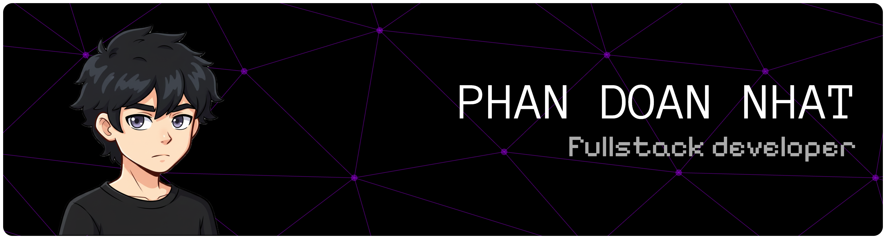

  

 
  

      
  

  

<h2 align="center">< :hammer_and_wrench: Languages and Tools /></h2>

   
   
   
   

<h2 align="center">< :fire: Streak Stats /> </h2>

  

<h2 align="center">< :computer: GitHub Profile Stats /></h2>

  <!-- 
   -->
  

<!-- <h2 align="center">< :heart: My Favorite Repositories /></h2>

  
<!--   
  
  
  
  

 -->

<h2 align="center">< 🐍 Just a snake eating my contributions /></h2>

  

<h3 align="center">Created by @doanndev :fountain_pen:</h3>
